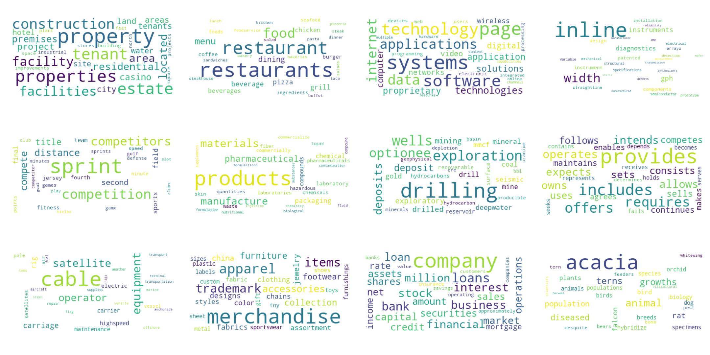
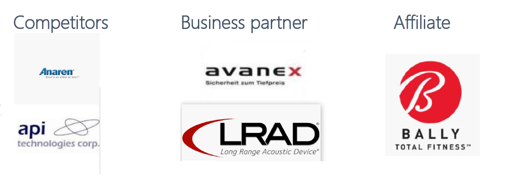

# Deciphering 10K: A Topic Modeling Approach

**No Errors No Warnings: Shuyan Huang, Shanglun Li, Ken Chen, Shaojie Ma**

Our data are 10-K reports of the US listed companies, scraped from the website of the U.S. Securities and Exchange Commission (SEC). A Form 10-K is an annual report required by  the SEC, that gives a comprehensive summary of a company's financial performance. We only use the first Item of the forms (Business) for our analysis. The data size is 2.25GB, containing 61,424 separate files from 1995 to 2008.

Usually, companies’ 10-Ks are structured in very stable patterns, which highlight the information regarding the company’s business. The salient readability of these files makes it possible for our algorithms to learn their latent topics and the relationships between companies. So we will test the following hypotheses: 

1. After converting all the words that appeared in these files into vector representations, we might be able to group the words into clusters(topics) and the weight of each word. By studying the words and their weights in each topic, we may be able to identify what are the underlying topics and compute the loadings of each file on these topics. 

2. After getting the topic loadings of each 10k file, we may able to identify similar company pairs and see why they are similar, and whether there’s any possibility of merging or acquisition.

## Part 1: Data Downloading, Preprocessing & Word2Vec

### get_filling.py

SEC provides index files for all historical documents, including information such as the type of document, the downloading address, and CIK of the reported company. Using the index files, we first filter the 10-k documents, and then use the addresses provided to download the files. After getting the raw files, we parse the html files to text, and extract the first Item (Business) from the text.

Since the index files are organized by quarter, there are 56 index files for the period 1995-2008. So the downloading and preprocessing are naturally paralleled over the index files. Using Python multiprocessing and 20 cores on a node, the whole process finished in 8 hours.

#### Outputs:

- One txt file "CIK_date.txt" for each company and each year. All files are organized in folders by year.

### word2vec.py

The second step of text data preproceesing includes removing punctuations, numbers, stop-words, and changing to lowercase. For each document, the words are cleaned and collected in parallel. Then using a tool provided by the Gensim package, the words are uniquely indexed and a dictionary is formed. Based on this dictionary, we convert the documents to bag-of-words, which is also executed in parallel. Finally, using Google's pretrained word-to-vec model, we find the vector representation of each word in our dictionary, which is also executed in parallel. Using Python multiprocessing and 20 cores on a node, the whole process finished in 1 hour.

#### Outputs:

- filename: pickle file that contains a list of the names of the documents
- 10k_dic: pickle file that contains a dictionary of the words and their indices. (i.e. {0:word0, 1:word1...})
- 10k_bow: pickle file that contains a list of the bag-of-words of the documents, following the order specified by filename and the indices specified by 10k_dic.
  - e.g. There are three words "apple", "orange" and "juice", two documents doc1 = "apple juice" and doc2 = "orange juice". Then filename would be [doc0, doc1], 10k_dic would be {0:"apple", 1:"orange", 2:"juice"}, 10k_bow would be [ [0, 2], [1, 2] ]. 
- vectors: saved numpy array that contains the word2vec vectors of all the words, following the order specified by 10k_dic.

## Part 2: K-means using MRJob 

### Overview 
In this part, we will use the .npy file of vector representations of words from Part 1. We first modified the format of the file, then we constructed the topic clusters using K-means algorithm. 

### Data Modification
The vector representation of words file is 1.29GB. There are a total of 537,358 vectors of length 300 in the file. As required by part 3, we need to use K-means to construct 20 clusters with indices of vectors included in each cluster. Thus, we first use np.load to load the .npy file. Then, we add the index to the end of each row of the vector and save the modified file. 

### Centroid Initialization
First, we randomly pick twenty indices. Then, we find the corresponding vectors according to the index number at the end of each row. 

### K-means Algorithms and Implementation
We use MapReduce to implement the K-means algorithm. For each iteration, the MapReduce algorithm is the following:

*	Mapper: For each line of vector representation of a word, we find the distance of that vector to the twenty centroids. Then, we find the cluster it belongs to according to the minimum distance between vector and centroids. Finally, we pass the cluster number it belongs to and a tuple with vector and its index to the combiner.

*	Combiner: For each cluster, we get several tuples passed by the mapper function. We add all the vectors together to get a sum vector and the count of how many vectors included. And we append the indices together and get a list of indices. Finally, we pass the cluster number and a corresponding tuple with the sum vector, count, and the indices list to the reducer.

*	Reducer: For each cluster, we get several tuples passed by the combiner function. We add all the sum vectors and the counts to get a total sum vector and a total count. Then, we can get the new centroid vector by calculating the mean using total sum vector divided by the total count. In addition, we concatenate all the indices list in the same cluster. Finally, we output the result twenty new centroid of clusters with the indices of vectors in it.  

*   Iteration: The above finishes one iteration of the K-means algorithm. Then, we use shell script to implement 100 iterations. It takes overnight to finish all the iterations. We find that the centroid converges at 88 iterations. 

#### Output for the next-step analysis:
*	centroid_final.txt: a text file including twenty clusters with centroid vector and corresponding vector indices included in it. 608KB

## Part 3: Singular Vector Decomposition + Loadings

### Overview of Part 3
In this part, we will take advantage of the ‘bag of words’ from Part 1 and the ‘topic clusters’ we got from part 2. Frequency matrices were constructed by using these pre-processed documents, and then we were able to implement Singular Vector Decomposition on these matrices, which implied what are the most important words for each topic, and how much does each document load on these topics respectively. So these were the hypotheses underneath our analysis.

### Pre-processed Data
The ‘bag of words’ file is 612MB, and the ‘topic clusters’ is 301KB, both of which are saved in binary formats. The ‘bag of words’ contains a list of 61,424 sub-lists, each representing the words count in each document. The ‘topic clusters’ is a list of 20 sub-lists, each records the word composition of that topic. Purposefully, I’ve deleted topics that contain too few or too many words.

### Algorithms and Implementation
*	The magic we are going to play here is the singular value decomposition. It is known as a factorization of a matrix of any size into single vectors. This is somehow similar to the concept of Principal Component Analysis. We can get vectors of loadings that illustrate row or column importance. By obtaining the first columns of U and V, we can see which rows and columns are contribute most to the original matrix. 

*	Extracting the information from the two documents, we can then build matrices of such type. And these matrices are the ones we will decompose. The first column of U are the word loadings of a topic, and the first column of V are the document loadings on a topic.

*	For the best of our knowledge, we are unable to implement the decomposition of a matrix in a parallel fashion and took the advantage of big-data paralleled frameworks like MapReduce or MPI. But the decompositions of matrices of different topics are naturally parallelizable. So we decided to use the Python Multiprocessing to exploit the multicores of the computer. Furthermore, since the entire process is prohibitively memory consuming, we’ve requested a 8-core cluster of 30GB memory space on Google Cloud. The entire process took 2,785 seconds on google cloud.

### Word Loadings and Document Loadings
*	We can directly get the word loadings from the previous step. Word clouds can be constructed from these vectors, where loadings can be interpreted as word frequencies.
*	By aggregating the document loadings, we can get a topic loading vector on the 12 topics for each document. The aggregation is conducted by year, and then we paired up all the document topic loadings, computing their distances and screen out the 50 pairs with the shortest distances. The computation of paired-distances is massive. We planned to use multithreading framework, but the parallel programming did not seem a good compensation for the overheads. These by-year distances altogether form an 8.12GB file. Then we fed these distances for a MapReduce TopK alogorithm, the 50 closest pairs were found for each year.

#### Output for the next-step analysis:
*	Word loadings on the 12 topics, 268KB
*	Paired-up distances for each year: 8.12GB
*	Closest pairs for each year: 128KB

## Part 4: word cloud and top-k results analyses

### Overview of Part 4
In this part, we first build a word cloud to see the 12 topic clusters and which words are most frequent inside each topic. Then we will analyze some typical pairs and the correlation between two these two firms through the results about nearest firms of top-k model. The conclusion is that our method can help find competitors, business partners and affiliates.

### Pre-processed Data
Top 50 nearest firms for each year got from top-k model.

### Results
* Word cloud is below:

  

  12 latent topics are uncovered by our K-means clustering. Additionally, we’ve computed the topic loadings on all these clusters and recovered the most loaded words, by mapping to the dictionary we got from the first steep. From the graphs above we know that some of clusters reflects the industry the firm belongs to.

* Top 50 analyses
  

  In this part, we use examples from our top-k model to illustrate 3 typical relationships between near firms. 

  * In SEC system, ANAREN is registered as a radio & tv broadcasting & communications equipment company. The nearest one for this company in the topic model is API Technologies Corp, which is registered as a semiconductor manufacture company. And we find that ANAREN is APIi's first competitor.
  * AVANEX is also a semiconductor manufacture company. Its pair is LRAD, which is household audio & video equipment. These two are in the same industry chain.
  * We also find a firm that matches many different firms. It is Bally Total Fitness in Illinois. It matches Bally Total Fitness of the Mid-Atlantic, Bally Total Fitness of Upstate New York, Ballyl Fitness & Racquet Clubs in Florida, Bally Total Fitness of Greater New York. So we can also use our method to find affiliate firms running the same business.